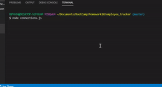

# employee_tracker

### Description

An app for managing a company's employees using node, inquirer, and MySQL.

### User Story

To utilize run these commands in the 

npm install inquirer
npm install mysql
npm install console.table

The when these are isntalled enter the command: node connections.js, to bring up the interface and use the arrow keys to navigate, enjoy!
photo of what it should look like in the command line: 

### Demo

  

Link to a complete demo video 
[https://drive.google.com/file/d/1Swle2oOZ309-9Juh0D76UUkndM73ftel/view]